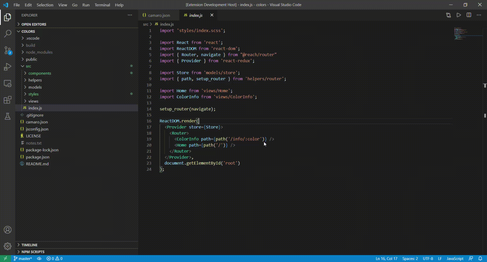

# FFTT

This extension allow use FF camaro and kitt in vscode

## Using cam,aro in your workflow.

Create a file named **camaro.json** and define the commands you want to use:

```
{
    "menu": {
        "Start development": "shell:npm run start",
        "Deploy Github Pages": "shell:npm run deploy"
    }
}
```

The camaro file support a section **custom_menu** the commands define there overwrite the commands in **menu** section

```
{
    "custom_menu": {
        "Start development": "@exclude"
    },
    "menu": {
        "Start development": "shell:npm run start",
        "Deploy Github Pages": "shell:npm run deploy"
    }
}
```

The extension create a menu with the options defined into the file.

You can create a camaro.json file into diferente folders the extension lookup the file bottom to up.




Icons made by <a href="http://www.freepik.com/" title="Freepik">Freepik</a> from <a href="https://www.flaticon.com/" title="Flaticon"> www.flaticon.com</a>

**Enjoy!**
